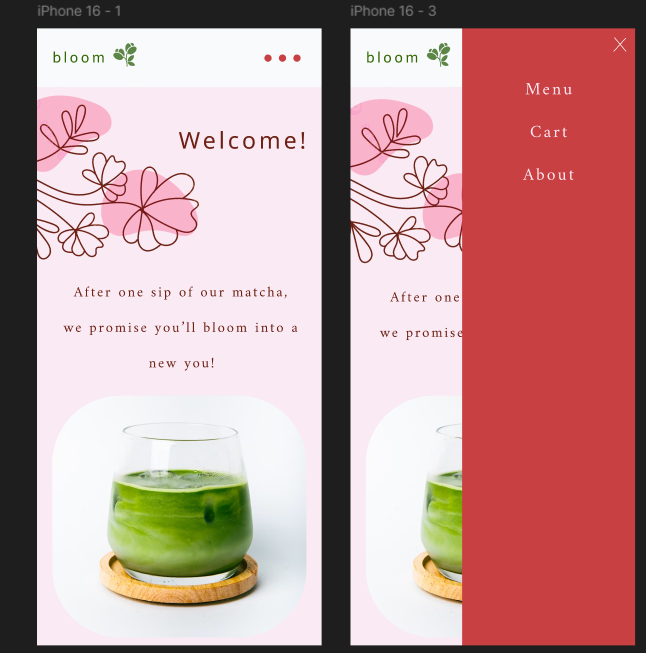
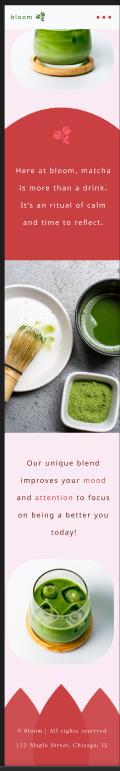

# Bloom — A Matcha Café Experience

## Overview

Bloom is a responsive React and TypeScript web app for a fictional matcha café, built as a UX engineering portfolio project. I designed it mobile first in Figma, then built it out in React using that design as my actual reference. The goal was to show how I think as a UX engineer: making real design decisions for the user, then building clean, maintainable code on top of them.

## Design Process

**Mobile first** — Most café visitors are probably browsing on their phone, so I designed for the smallest screen first. That forced me to prioritize what actually matters on the page before scaling up to bigger screens, instead of cramming a desktop layout down later.

**Navigation** — Instead of a typical nav bar competing with the hero image, I used a small icon that opens a full screen slide-in panel with Menu, Cart, and About. It keeps the first screen calm and focused on the brand while still being one tap away.

**Colors and type** — I went with a soft pink and deep coral palette instead of the bright bold colors most food apps use, to match the calm, ritual feel of the brand. I paired a serif font for headlines with a clean sans serif for body text to keep things readable.

**Accessibility** — Nav opens on click, not hover, so it works on mobile and keyboard. Text and background colors are checked for contrast, and interactive elements have visible focus states.

**Figma to code** — Once colors, spacing, and fonts were locked in Figma, I turned them into CSS variables so they're used consistently across the app. I'm using CSS Modules to keep component styles scoped and organized.

## Tech Stack
- React + TypeScript
- CSS Modules
- Figma (mobile-first design)
